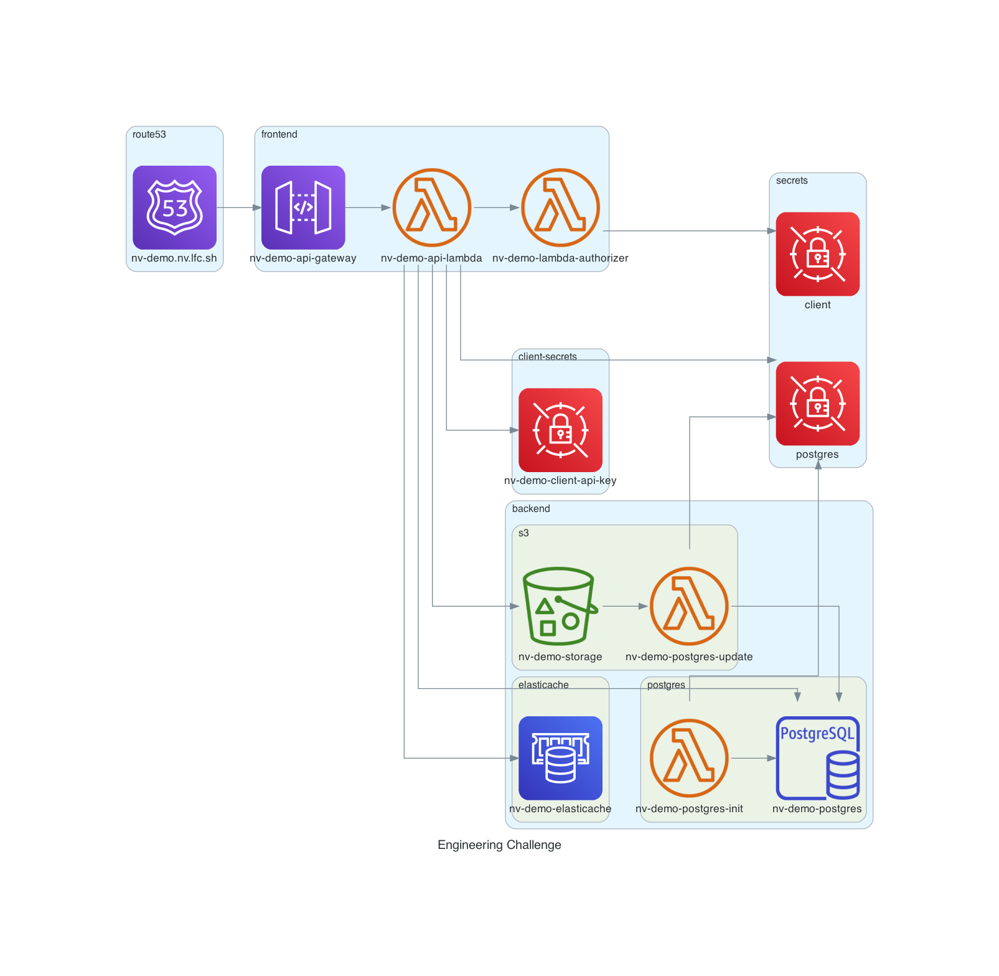

# nv-demo

This is the code for the engineering challenge. This project deploys the following:

- A Terraform state S3 bucket (`./terraform/nv-demo-terraform-state`).
- A VPC project, deploying the VPC, subnets, routing, and other network specific resources (`./terraform/vpc`).
- A secrets project, which creates the AWS secrets for the demo. NOTE, THESE WOULD NORMALLY NOT BE IN TERRAFORM, THEY ARE FOR DEMO PURPOSES ONLY. (`./terraform/secrets`).
- A client-api-key project, which defines the AWS secret for the client API key (`./terraform/client-api-key`).
- A Postgres DB (version 14) and postgres-init Lambda (`./terraform/postgres`).
- An S3 storage project, including S3 bucket, S3 notification, and postgres-update Lambda (`./terraform/s3-storage`).
- A Route53 domain for `nv.lfc.sh` (`./terraform/route53`).
- Elasticache Redis (`./terraform/elasticache`).
- A frontend, including a Route53 entry, ACM, API Gateway, api Lambda, authorizer Lambda (`./terraform/frontend`).
- A monitoring project, including AWS Canary (`./terraform/monitoring`).



The goal was to provide a fully functional demo, specifically where a file could be uploaded to S3 and a Postgres DB would be appropriately updated, complete with authentication. Please note, the functionality of `create_uploads.py` is in `./src/api/api.py`.

Some quick usage examples:

- To get a list of files:

```bash
# pipe to jq for cleaner output. Also available at /api/list
❯ curl -s -u nvclient:mysecretkey https://nv-demo.nv.lfc.sh
[{"filename": "file2", "prefix_path": "foo/file2", "s3_bucket": "nv-demo-storage", "url": "https://nv-demo.nv.lfc.sh/file2", "date_added": "2022-05-01T12:11:48.443Z"}, {"filename": "example", "prefix_path": "example", "s3_bucket": "nv-demo-storage", "url": "https://nv-demo.nv.lfc.sh/example", "date_added": "2022-05-01T13:32:11.526Z"}, {"filename": "foo", "prefix_path": "foo", "s3_bucket": "nv-demo-storage", "url": "https://nv-demo.nv.lfc.sh/foo", "date_added": "2022-05-01T19:51:38.987Z"}, {"filename": "testingput", "prefix_path": "testingput", "s3_bucket": "nv-demo-storage", "url": "https://nv-demo.nv.lfc.sh/testingput", "date_added": "2022-05-01T20:27:50.953Z"}]
```

- To download a small file:

```bash
❯ curl -s -u nvclient:mysecretkey https://nv-demo.nv.lfc.sh/example
this is my example file.
```

- To upload a small file:

```bash
❯ cat anotherfile
here is another example file.
complete with newlines
❯ curl -s -u nvclient:mysecretkey -XPUT -T anotherfile https://nv-demo.nv.lfc.sh/api/upload/anotherfile
"File uploaded"%                                                                                              
❯ curl -s -u nvclient:mysecretkey https://nv-demo.nv.lfc.sh/anotherfile
here is another example file.
complete with newlines
```

## Requirements

- Admin access to a particular AWS account.
- Terraform v1.1.7
- Python 3.6.15 (`pyenv` is very useful here)
- jq

## Deployment

These deployments are locked to a playground AWS account I use (you'll see the account ID locked in `provider.tf`). Again, I am Terraforming things that might already be provided, for completeness.

- Terraform the remote state. Depending on team size, you may want to use DynamoDB for state locking.

```bash
cd ./terraform/nv-demo-terraform-state
terraform init
terraform apply
```

- Terraform the VPC. CIDR and names are found in `variables.tf`.

```bash
cd ./terraform/vpc
terraform init
terraform apply
```

- Terraform the AWS secrets. **This is for this demo only**. I'm putting the secrets in the actual repo, not something I would normally do. For this demo, it makes it easy to provide access to review the infrastructure.

```bash
cd ./terraform/secrets
terraform init
terraform apply
```

- Terraform the client-api-key AWS secret. This is for access to the remote service. Note there is a `terraform.tfvars` file that contains the secret value. This is normally not checked in, but for this demo, it will be.

```bash
cd ./terraform/client-api-key
terraform init
terraform apply
```

- Terraform the postgres project. This includes a postgres-init lambda, which would be used for initializing a DB environment.

```bash
cd ./terraform/postgres
terraform init
terraform apply
```

To initialize the DB, run the `postgres-init` lambda:

```bash
# Can update the lambda to perform migrations in the future!
aws lambda invoke --function-name nv-demo-postgres-init --cli-binary-format raw-in-base64-out --payload '{"name": "init"}' /dev/stdout
```

In the AWS logs, you should see the initialization

```bash
❯ aws logs tail "/aws/lambda/nv-demo-postgres-init" --follow

2022-04-30T22:39:17.740000+00:00 2022/04/30/[$LATEST]6d35e39638b44742b714327eccd06a48 START RequestId: b640040d-b5d3-4e2c-80f7-c3ee47215af2 Version: $LATEST
2022-04-30T22:39:17.741000+00:00 2022/04/30/[$LATEST]6d35e39638b44742b714327eccd06a48 {'name': 'init'}
2022-04-30T22:39:19.350000+00:00 2022/04/30/[$LATEST]6d35e39638b44742b714327eccd06a48 END RequestId: b640040d-b5d3-4e2c-80f7-c3ee47215af2
2022-04-30T22:39:19.350000+00:00 2022/04/30/[$LATEST]6d35e39638b44742b714327eccd06a48 REPORT RequestId: b640040d-b5d3-4e2c-80f7-c3ee47215af2  Duration: 1608.89 ms    Billed Duration: 1609 ms        Memory Size: 128 MB  Max Memory Used: 77 MB   Init Duration: 411.87 ms
```

- Terraform the s3-storage. This includes a lambda that updates the list of files in the S3 bucket via an S3 bucket notification subscription:

```bash
cd ./terraform/s3-storage
terraform init
terraform apply
```

- Terraform the route53 domain. Will require updating the parent domain and adding the NS servers from the output:

```bash
cd ./terraform/route53
terraform init
terraform apply
```

- Terraform ElastiCache, for caching queries. I didn't really get to use this or truly implement it. I could be missing the true request of the Postgres caching requirement. I'm not quite sure how to address that and unsure of what the requirement wants.

```bash
cd ./terraform/elasticache
terraform init
terraform apply
```

- Terraform the frontend. This creates a Route53 entry for a custom domain, ACM for TLS, API Gateway, an api Lambda, and an authorizer Lambda.

```bash
cd ./terraform/frontend
terraform init
terraform apply
```

- Terraform monitoring. This creates a simple AWS Canary to monitor the endpoint. It accesses the endpoint once per day at 12:00 UTC.

```bash
cd ./terraform/monitoring
terraform init
terraform apply
```

## Notes and Improvements

Things I remember and/or didn't get to due to time.

- I just kept variables in `variables.tf`. Variables should probably be defined in a `.tfvars` file. Just mentioning. Although I did do that for the `client-api-key`.
- Add descriptions to the Terraform variables to explain them better.
- My code is a bit sloppy in areas and some of it doesn't work as well as I'd want (presigned URLs, should have stored file size as well).
- Would have been cool to save user credentials in DynamoDB or something. Or something else, maybe a true auth backend. I just did a half baked user lookup for PoC.
- I didn't quite understand the caching request.
- Monitoring could be expanded drastically.
- I would have liked to have split up `api.py`. A little better organization would have been nice.
- Just realized that my lambda-authorizer breaks my naming convention (example: api = `nv-demo-api-lambda`, authorizer = `nv-demo-lambda-authorizer`).
- My secrets break naming convention. Doh.
